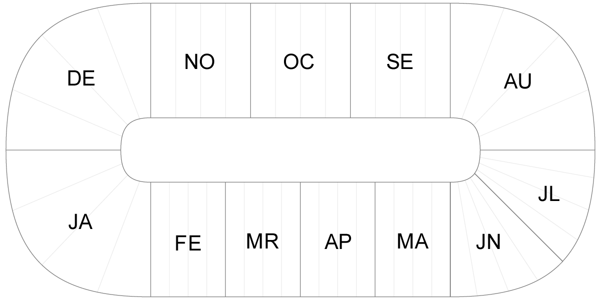

# Mental Visualizations: The Year Loop

**Do you ever think about how you think about the calendar year? Meta-thinking? We all have our little quirks about how we see and visualize things in our mind. The following is how the year passes in my mind.**

The year is represented as a two-dimensional loop that rotates and scales in three-dimensions with a black void as the backdrop. The months start with January at the top left then proceeds counter-clockwise ending with July at the bottom left. August then connects to July on the bottom right and it’s a straight shot to December, which connects back to January. Have a look at the graphic on the right to get an understanding of how the system is designed.

## Three Dimensions of Calendar

The graphic presented on the right is a static version of the what the calendar year would look, if it was zoomed-out. In my mind though, it is never presented zoomed out. It moves around and repositions itself depending on the context—and context is very important. As an example, lets say I am at the tail end of December and am looking forward in time to January. The year loop would go into a perspective mode that presents January top centre and December below. As time passes in January the calendar flies around the January curve towards February. And now I can see February and the next few months ahead of me.

## Pictures Are Worth a Thousand Words

Especially when describing something that only I can only—and ever will—see. So I have created a very basic mock-up of the year loop in a three-dimensional Flash movie.

	<figure style="text-align:center; background-color:#000;">
		<embed src="year-loop/year-loop.swf" type="application/x-shockwave-flash" allowscriptaccess="always" width="700" height="400">
	</figure>

The representation is very basic and only really presents one context: looking ahead in month view. The year loop in my mind is much more dynamic and flexible. Instead of feeling like a solid plastic mass (like in Flash) it is more of a flexible fabric object. The months bend, stretch and adjust based on time and view. Also, in my mental visualization all the days of each month are represented on the loop, not just the weeks.

## Context is Important

As I mentioned earlier, the year loop is very context based. In the Flash example we can see only the months. But if I wanted to look at the last week of February the year loop would spin around and put February into a view similar to a standard wall calendar. The view would still have quite a bit of perspective and I can see March starting at the bottom and January fading away at the top. This view also lets me zoom in to specific weeks and days.

Another aspect of the context is when I am looking forward from December. The January that I see is next year. Similarly, when I look back from January I see the previous year’s December.

## The Passage of Time

My mental understanding of the passage time is also represented in my year loop. You can see that February to July are actually *shorter* months compared to the autumn months. This is from my internal clock that always feels those months speed by faster than the fall months.

## Calendar Directionality and Holidays

Another interesting aspect is the directionality of the calendar. From January to July, I have the passed months behind me, as though I am looking forward to something. The summer possibly? But when I hit August the calendar turns and I start looking backwards, trying to hide the future behind my field of view. It’s my belief that my mental calendar faces towards the closest holiday or time-off period: in January I am facing the summer, in August I am looking back on the summer and trying to avoid September. Then in October, the calendar starts to turn again, this time looking forward to the winter holidays and the new year.

## Interesting Limitations

One interesting quirk is that months always end on the far right of their box, regardless of whether they end on a Saturday or not. And similarly months always start on the far left of their box, whether they start on a Sunday or not. My mental model does not generally recognize mid-week month starts/ends. Instead, when I need to understand, the graphic is replaced by a picture of a calendar, usually the one hanging on my wall showing the mid-week month switch. (This year it is my Chuck Norris Facts calendar.) This somehow is related to my constant forgetfulness of months starting in mid-week.

## What Does it All Mean, (Basil)?

Well, I can’t really say. I am sure it says something about my personality, abilities and learned behaviours from a psychological perspective—but what, I don’t know. When talking to [Liz](http://lizkerrison.ca) about this post, she reminded me of her mental visualization of the calendar year. It is similar than mine, but also different. Her’s travels clockwise and is more circular from January to August. Then in September it is a straight line up to December where it reconnects with January.

It is interesting to me to think about how my mind thinks about things and equally as interesting to see how other people think about things. Or even if they think about how they think about things. Also, it would be interesting to see the similarities and differences between everybody’s mental visualizations. Meta thinking, think about it. (Don’t you love that cheesy final sentence!)

**Tomorrow, this post will be followed up with another post in the series: [Colour Association](/articles/mental-visualizations-colour-association/).**
